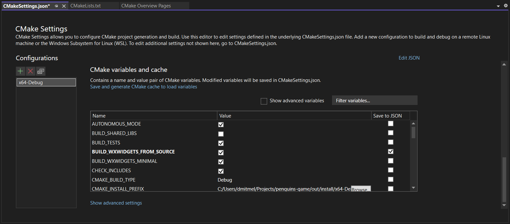

# The Penguins Game!

A clone of the board game **"Hey, that's my fish!"** written in C and C++ for a university programming course.


## Rules

- The game is played on a board consisting of square tiles, which is randomly generated at the start of the game. Each tile is either an empty square with water, or an ice floe with one, two or three fish on it.
- Every player has a certain number of penguins (typically 2 or 3) that they use for playing the game.
- The game starts in the _placement phase_ where the players must place their penguins (in turns) on the board.
  - They can do it in whichever way they want, the only condition is that the penguins must be placed on unoccupied ice floes with a single fish.
  - When a penguin is placed, the fish on the tile it was placed on is automatically collected (this is explained below).
- Once all penguins have been placed, the _movement phase_ begins, in which the players, well, take turns to move their penguins.
  - Penguins can move either horizontally or vertically in a straight line over any number of ice tiles, however they can't jump over water or other penguins.
  - After a penguin is moved, the ice floe it was on "sinks" and becomes a water tile (consequently, it is removed from the board and other penguins can't step on it anymore) and the fish on the tile it has been moved onto is "eaten" by the penguin. For every collected fish one point is added to the player's score.
  - A penguin can become blocked by water tiles on all four sides, in which case it there are no possible moves for it (hint: you can use this to your advantage). If all penguins of some player are surrounded like that, this player's turn is skipped, but otherwise the player is obliged to make a move.
- The game ends when no player can make any moves. Whoever collects most fish wins.

## How to play

This project comes with two interfaces for playing the game - a text one and a graphical one.

### Graphical interface

Upon launching the application you will be greeted by the following screen:


To start playing you have to, obviously, click the "New Game" button. It will bring up the following window:


Here you can set the parameters of the game (the labels should be more or less self-descriptive). Most of them are set to default values which are good enough, but you must enter the names of the players before beginning. The drop-downs near the player name boxes lets you choose whether this particular player is a normal human or a bot program will be playing instead, allowing either for two players sitting in front of the computer to play against each other, or for you to play against a computer program (yes, you can change both players to be bots to pit them against each other). After entering the parameters press "OK" to start the game.


This is how the game screen looks (~~notice the 100% original sprites that definitely aren't based on any other game at all~~). The game, of course, starts in the placement phase. To place a penguin, simply select and click a desired tile using the mouse, the tiles penguins can be placed on will be highlighted.


When all penguins have been placed, the players can move their penguins either by selecting a penguin, clicking it, then selecting a destination tile and clicking that, or simply by selecting a penguin and dragging it to the desired tile. The tiles a penguin can be moved on also are highlighted.


The boxes on the top show the scores of the players, the current player is highlighted with the red outline. The application also displays hints in the bar at the bottom, for example by notifying when a move can't be performed.


The panel on the left records the performed moves, you can select one to view it (the "Back to the game" button will exit the viewer mode).


That's it! Once the game ends, a table with the summary will be shown:


### Text interface

Works in the terminal/console. Upon launching you will be asked to enter some parameters of the game:


The players will first be asked to enter coordinates for placing their penguins:


And then for the movement phase they are first asked for the coordinates of a penguin to move and then for the destination coordinates:


## Implementation overview

Strictly speaking, the task set by the course demanded writing only the terminal interface and the bot (more on that later) in plain C. Nevertheless, it was decided to implement the graphical interface for street cred and bragging rights, and also most effort was spent on it, hence it has more features than the text one. However, as we now had to work with three different interfaces - the interactive-mode graphical and terminal interfaces plus the autonomous-mode interface for the bot (again, more on that later), this necessitated some architectural considerations.

The project is divided into three main components: a standalone app for the graphical interface, a command-line program containing the terminal interface together with the autonomous mode commands, and a library shared between both, which implements the game logic. To follow the formal requirements, the library and the terminal interface are written in C99 without the use of any external libraries, and since there were no constraints with regards to the GUI, it is written in C++11 using the library [wxWidgets](https://www.wxwidgets.org). Both the GUI and the TUI are cross-platform and work on Linux, Windows and macOS. We are also using the library [munit](https://nemequ.github.io/munit) for unit testing the game logic library.

Another notable component is the bot for automatically playing the game. The algorithm of the bot itself, which considers what move to make given a state of the game, is implemented in the common logic library, and therefore is usable by the user interfaces to let the player compete against the computer. However, in the course task the bot served a different purpose: basically, there was a program which would pit the bot algorithms written by students against each other in a competition. This program would invoke the bot programs in turns, giving them a file with the game state in a simple machine-readable format (simple enough to be parsed with `scanf`). The bot was then supposed parse the command-line arguments because some data like the game phase wasn't stored in the state file, then load the state by reading the input file, evaluate and make a move, and finally write to the output file the new game state in the same format - this machine interface is the so-called the autonomous mode.

Unfortunately the competition program itself isn't available since it is closed source and was created by the university, but really it doesn't do much more than just invoke our programs in a loop and render the board to the screen, so it _could_ be more or less trivially reimplemented, but honestly I didn't want to bother. Although it can be substantially improved: for example, it lacks an anti-cheating system. For all it cares, the bot program can give itself any number of points, move opponent's penguins, or place them in the ocean, or even regenerate the board entirely if it didn't like it - the only check that is performed is whether the number of penguins on the board is correct.

## Building and running

The project is built using [CMake](https://cmake.org) which has integrations with pretty much every IDE nowadays, so you can just clone the repository, import the project into your favorite IDE, and run any of the targets `penguins`, `penguins-gui` or `penguins-tests`, also typically IDEs allow changing the build options and editing the CMake cache. For UNIX systems (i.e. Linux and macOS) a Makefile wrapper is provided for convenience, using it is very straightforward:

```bash
# NOTE: It is recommended to use the flag -j8 when running Make to utilize
# multiple CPU cores for compilation (replace the 8 with the appropriate number
# of parallel processes for your system).

# To compile everything:
make
# To change the build directory (the default is 'build'):
make BUILD_DIR=something
# Some options are exposed as variables in the Makefile, others can be passed
# through CMAKE_EXTRA_FLAGS
make CMAKE_BUILD_TYPE=Release CMAKE_EXTRA_FLAGS='-DBUILD_TESTS=OFF'
# Ninja can be used as the build runner instead of Make
make CMAKE_GENERATOR=Ninja
# To re-generate the build files, e.g. when changing the CMake options
# (normally this happens automatically)
make cmake

make build        # compiles the TUI
make build-tests  # compiles the tests
make build-gui    # compiles the GUI
make run          # compiles and runs the TUI
make test         # compiles and runs the tests
make run-gui      # compiles and runs the GUI

# If it is necessary to run any of the executables with command-line arguments:
make build && build/penguins some=option something=else
make build-tests && build/penguins-tests --help
# Or in GDB:
make build-gui && gdb build/penguins-gui
```

It is also possible to just invoke CMake directly from the command-line on any platform:

```bash
cmake -B build -DCMAKE_BUILD_TYPE=Debug
cmake --build build
```

### Instructions for Visual Studio

If you are using Visual Studio, there exist two ways of loading the project in it. You can either import it as a CMake project within the IDE, or you can generate the Visual Studio solution files with CMake and open those:

```bash
cmake -B build -G "Visual Studio 17 2022"
# Or any other VS version, check cmake --help for the list of available generators.
```

Apparently, doing it with the second method doesn't make VS generate as many temporary files and thus reduces the disk usage, however, the integration with CMake becomes much more shallow (e.g. you can't edit the configuration options inside VS), so it is unclear which method we recommend.

Anyway, as for the "official" method of working with CMake projects, you first need to find the option `File > Open > CMake...` in the menu bar:


Click it and select the `CMakeLists.txt` file at the root of the project in the file picker. Alternatively, you can use `File > Open > Folder...` or the `Open a local folder` button on the start screen to open the folder with the project - the `CMakeLists.txt` file will be automatically detected. Once the project is opened, Visual Studio will begin configuring CMake, generating the build files and indexing the source code in the background.

Visual Studio has a concept of build configurations - basically, different settings per CPU architecture (32-bit or 64-bit, ARM or x86), build profile (debug or release), compiler (MSVC or Clang) and so on and so on. Choosing a different configuration will pass different options to CMake and the compiler. Configurations and other CMake settings can be edited either by opening the configurations drop-down in the toolbar (you can also switch the configurations here later) and selecting `Manage Configurations...`:


Or by selecting `Project > CMake Settings for penguins` in the menu bar, or by opening the `CMakeSettings.json` file in the root project directory, where those settings are saved to. All of the following methods will bring up the following screen:


Here you can change the various settings and, of course, manage the build configurations. To add one, click the green plus icon above the list on the left. A dialog with the list of various available configurations will appear, but most of the time you'll be interested in having only `x64-Debug` (which is created by default) and `x64-Release`.

By scrolling to the bottom of the settings page, you'll find a table where you can set and change the values of the CMake configuration (and cached) variables. After editing the variables and other settings you must save the `CMakeSettings.json` to apply the changes and regenerate the project files (the modified variables will be highlighted with the bold font).



When building the project, the compiled executables will appear in the `out/build/<CONFIGURATION_NAME>/` directory. To select which one to run or debug, open the startup item drop-down in the toolbar:


More information on using CMake from Visual Studio can be found on MSDN:

- <https://learn.microsoft.com/en-us/cpp/build/cmake-projects-in-visual-studio?view=msvc-170>
- <https://learn.microsoft.com/en-us/cpp/build/customize-cmake-settings?view=msvc-170>
- <https://learn.microsoft.com/en-us/cpp/build/get-started-linux-cmake?view=msvc-170>

### Compilation of the GUI and wxWidgets

If wxWidgets can't be found on your system, the GUI simply won't be available, but otherwise the project can be compiled just fine. Installing wx, however, sometimes isn't exactly trivial. Generally, you can either use a pre-built version of wxWidgets (installed with a package manager, for example) or download and compile it from source on your system. The latter is relatively simple, all you have to do is enable the `BUILD_WXWIDGETS_FROM_SOURCE` option, like this:

```bash
cmake -B build -DBUILD_WXWIDGETS_FROM_SOURCE=ON
# When using the Makefile wrapper:
make BUILD_WXWIDGETS_FROM_SOURCE=ON
```

The CMake script will automatically download the source code of wxWidgets and compile it for you when building the project. This, however, requires a few hundreds of megabytes of disk space (usually under a gigabyte, something like 500-700 MBs) and a couple minutes to compile everything. Generally, to reduce the compilation time and disk usage a lot of components of wx are switched off in the script [wxwidgets_config.cmake](cmake/wxwidgets_config.cmake) to produce a minimal build only with the stuff that our application actually uses. The disk usage can be reduced even further by roughly a half with `wxBUILD_PRECOMP=OFF`, though it will double the time needed to compile wx.

The way of obtaining a pre-built version of wx (and its dependencies) is specific to your OS.

**Windows**

Well, on Windows you have to jump through some hoops to get wx to work. First of all, you'll have to use MSVC (the compiler included with Visual Studio). It is possible to compile the app using MinGW, however, it generates executables that can't be started due to some linking errors related to unresolved symbols within the standard library (don't ask; note though, that if you want to try to get it to work, you have to compile with `wxBUILD_PRECOMP=OFF`). Furthermore, MSVC is much faster than MinGW, at least in the case of our application, so even building wxWidgets from source doesn't take much time. Anyway, to download the wx libraries, go to <https://wxwidgets.org/downloads/> and in the block of the latest stable release find and click the button "Download Windows Binaries". Select the section appropriate for your Visual Studio version, and download the header files and development files and release DLLs for 64-bit systems. Unpack all three archives into a directory (replacing all files), say, `C:/wx/3.2.1`, create an environment called `WXWIN` and set it to that directory for automatic detection of the wx installation by CMake.

**Ubuntu/Debian**

```bash
# Currently the versions of wx libraries in the official repositories are too
# old for our app, so you'll have to add third-party repos with more up-to-date
# versions:
sudo apt-key adv --fetch-keys 'https://repos.codelite.org/CodeLite.asc'
sudo apt-add-repository 'deb https://repos.codelite.org/wx3.2/debian/ bullseye libs' # for Debian 11
sudo apt-add-repository 'deb https://repos.codelite.org/wx3.2/ubuntu/ focal universe' # for Ubuntu 20.04
sudo apt-add-repository 'deb https://repos.codelite.org/wx3.2/ubuntu/ jammy universe' # for Ubuntu 22.04
sudo apt-add-repository 'deb https://repos.codelite.org/wx3.2/ubuntu/ kinetic universe' # for Ubuntu 22.10
# And so on and so on, you get it, you must put the distro codename in the repo line.
sudo apt-get update
# Now, install wx and other packages required for development:
sudo apt-get install libwxgtk3.2unofficial-dev libgtk-3-dev libnotify-dev

# Alternatively, once the repositories catch up to v3.2, you can simply install
# it like this:
sudo apt-get install libwxgtk3.2-dev libgtk-3-dev
```

**Arch Linux**

```bash
sudo pacman -S wxwidgets
# That's it, fortunately at least here this is very easy.
```

**macOS**

```bash
brew install wxwidgets
```

Additionally, if you have installed wxWidgets in a non-standard location, or downloaded the source code yourself and compiled it in some other directory (or you want to do that, see the [platform-specific documentation for wx ports](https://docs.wxwidgets.org/trunk/page_port.html), the [page on building wx with CMake](https://docs.wxwidgets.org/trunk/overview_cmake.html), and the [page on building wx on Windows](https://docs.wxwidgets.org/trunk/plat_msw_install.html)), when building this project you can point CMake to the location of your installation of wx by setting the CMake variable `wxWidgets_ROOT_DIR` (or the environment variable `WXWIN`) to the installation directory on Windows or `wxWidgets_CONFIG_EXECUTABLE` (or the environment variable `WX_CONFIG`) to the location of the `wx-config` program within the installation on other OSes, like this:

```bash
cmake -B build -G "Visual Studio 17 2022" -DwxWidgets_ROOT_DIR="C:/wx/3.2.1"  # on Windows
cmake -B build -DwxWidgets_CONFIG_EXECUTABLE="/home/abc/wx/3.2.1/wx-config"   # on Linux
make CMAKE_EXTRA_FLAGS='-DwxWidgets_CONFIG_EXECUTABLE=/blah/blah/blah/wx-config' # with the Makefile wrapper
```

It should also be noted though that to get a static executable for the GUI (that is, a standalone executable that doesn't require DLLs of wxWidgets to be installed or shipped alongside it) you must compile wx from source. If you are doing it in a separate directory as explained in the paragraph above, you will need to set `BUILD_SHARED_LIBS` and `wxBUILD_SHARED` to `OFF` when building wx itself.

### Running the tests

To just check that everything works you can simply run `make test` to run the entire test suite as explained above, however, the test runner, munit, also has its own [command-line interface](https://nemequ.github.io/munit/#running-tests) with options, for example, for filtering which test cases to run. For tests that depend on random values and randomly fail on some of them, munit offers a way of running the test suite with a specified seed to reproduce the issue. Each time the test suite is run, the PRNG seed is printed, which you can then reuse like this:

```bash
make build-tests && build/penguins-tests --seed 0xdeadbeef
```

## The code

All in all, it is a bit messy at times, but the number of insane hacks and (ab)use of advanced language features has been kept to a minimum so as to make it simple and easy to follow (hopefully even for beginner C programmers).

### General guidelines

- The code is formatted using [clang-format](https://clang.llvm.org/docs/ClangFormat.html) which handles the superficial stuff like placing the parentheses and braces, indentation, alignment and so on and so on. The notable decisions are:
  - The indentation is 2 spaces
  - Lines shouldn't be longer than 100 characters and comment lines shouldn't be longer than 80 characters (these two aren't hard rules)
  - The asterisk in pointer declarations (and the ampersand in reference declarations) should be put adjacent to the type, not the variable name
  - Use `//` for normal comments and `///` for documentation
- The naming convention for things is:
  - Functions, methods, macros, fields and variables - `snake_case`
  - Constants and enum variants - `UPPER_SNAKE_CASE`
  - Structs, classes, enums and typedefs - `CamelCase`
- `#include` directives should reflect the stuff that a code file actually needs, i.e. there should be no useless `#include`s (when a file includes stuff that it doesn't actually use) and all the necessary declarations should be `#include`d directly (instead of relying on a transitive include from some other file which might be removed at any time).
  - This is ensured with [include-what-you-use](https://github.com/include-what-you-use/include-what-you-use#readme) (aka IWYU), though only if this tool is installed. IWYU also has a set of its own special directives (`// IWYU pragma: `) to tell it when it is wrong (e.g. when an `#include` is actually required), the full list of which can be seen [here](https://github.com/include-what-you-use/include-what-you-use/blob/master/docs/IWYUPragmas.md).
- [Doxygen](https://www.doxygen.nl) comments are used for documenting the code.
  - The generated documentation pages can be found here: <https://dmitmel.github.io/penguins-game/>.
  - Generally speaking, the code should be written in a readable way in the first place, and then non-obvious behavior or techniques should be documented (for example, a field `name` of a struct `User` doesn't need a comment stating "The name of the user.", unless of course there is something more to add).
  - Put the documentation near the actual definition: the comments for functions should be put next to their code in the source files (or for an inline function in the header file since that's where its code is), for structs and their fields - next to the declarations in the header files. As the documentation may often point out implementation details or simply explain what the implementation actually does, it should be located alongside the implementation itself, so that you don't forget to update the former when changing the latter.
- I generally program in a [defensive style](https://en.wikipedia.org/wiki/Defensive_programming) - this means (among other things) putting little assumptions on the input data and being explicit about what you assume, sprinkling the code with lots of `assert`ions, handling and reporting potential errors and so on and so on. This approach helps with debugging since the program will tend to explode immediately instead of collecting subtle bugs, and generally helps with understanding the code and the expectations placed upon it.
- While developing I have also used various sanitizers: [ASAN](https://clang.llvm.org/docs/AddressSanitizer.html), [LSAN](https://clang.llvm.org/docs/LeakSanitizer.html) and [UBSAN](https://clang.llvm.org/docs/UndefinedBehaviorSanitizer.html) - these are plugins for the compiler (supported by GCC, Clang and [MSVC](https://learn.microsoft.com/en-us/cpp/sanitizers/asan?view=msvc-170)) which catch common memory-management bugs such as using memory after it has been freed, accessing an element of an array at an out-of-bounds index, dereferencing a NULL pointer, or even memory leaks, by stuffing the compiled machine code with extra checks behind the scenes. They can be turned on in this project by enabling the `USE_SANITIZERS` CMake option. While doing so introduces a noticeable slowdown, the sanitizers GREATLY help with debugging.

### Project file structure

- `CMakeLists.txt` - the [build script for CMake](https://cmake.org/cmake/help/latest/index.html)
- `cmake/` - supplementary scripts and configs for CMake and the compilation process in general
- `build/` - the output directory for compiler artifacts and byproducts (the produced executables are put here)
- `src/` - source and header files
  - `gui/` - specifically the source code of the GUI
- `resources/` - various non-code files used by the app, such as the assets for the GUI
- `docs/` - asset files for use in the documentation

### Header files

The C headers should be written in this form:

```c
#pragma once

#include "something.h"
#include "else.h"

#ifdef __cplusplus
extern "C" {
#endif

// declarations go here

#ifdef __cplusplus
}
#endif
```

The `#pragma once` at the start ensures that when a header is included multiple times (say, A includes B and C, and C includes B - B is included two times in total), it will actually be copy-pasted into the compiled source file only once. The `#ifdef __cplusplus` guards provide compatibility with C++ - if the header is included from a C++ source file, they signal to the C++ compiler that the functions in question have been implemented in C. This is required because C and C++ often have different ideas on what machine code to generate for equivalent at first glance code.

Conversely, when writing C++ headers, only the `#pragma once` statement at the top is necessary.

Additionally, if a source file defines functions that only it itself then uses in its own internals, those functions shouldn't be declared in the corresponding header and should instead be marked with `static` in the source, which in C terms roughly means that the function is private to that file.

### Inline functions

One (a little bit) advanced feature of C that has been used throughout the project as an optimization are inline function definitions. Short, straightforward and frequently used functions can be marked as `inline`, which will allow the compiler to literally substitute the machine code of the function in place of the instructions to call it at the invocation site. When applied wisely, this unlocks more compiler optimizations because the compiler can also see the flow of control and data within the inlined function and integrate it better with the machine code of the caller, improving the performance of the program (sometimes the function may even be so simple that invoking it takes more time than executing the code inside).

The `inline` keyword was originally introduced in C++ and made its way back into C with compiler-specific implementations and was later standardized in C99, which differed slightly from those and from the usage in C++. The C99 inlining model is what I use in this project, which in practice works as follows:

```c
// First you declare and implement the function within the header file, so that
// every usage site has access to the full definition of the function:
inline int add(int a, int b) {
  return a + b;
}

// Strictly speaking that's enough, however, since the compiler might not
// always decide to integrate the code of the function into a caller (as it
// might consider the cost of doing so too high or simply because in the debug
// configuration the function inlining optimization is disabled) and since
// there are cases when it may be simply impossible, we need to have an actual
// definition of the function within the compiled binary. For that you have to
// put a copy of the declaration with the `extern` keyword in EXACTLY ONE
// source file (this will cause the function to be instantiated once for real
// in the binary), like this:
extern int add(int a, int b);
```

More in-depth information can be obtained from the documentation of [MSVC](https://learn.microsoft.com/en-us/cpp/cpp/inline-functions-cpp?view=msvc-170) and [GCC](https://gcc.gnu.org/onlinedocs/gcc/Inline.html).

## Using the autonomous mode interface

(This is a bit of an obscure part of the project since it's intended for use with the competition manager program given by our university, but I documented it nonetheless to not let the information sink into oblivion.)

The terminal interface program accepts command-line parameters and may be invoked in the following two ways:

1. `./penguins phase=placement penguins=N input_board.txt output_board.txt`

   The program will read the game state from `input_board.txt`, place a penguin on the board if possible, write the new game state to `output_board.txt` and exit. The `penguins=N` parameter specifies the number of penguins available to every player, and the program can't place any more penguins than that.

2. `./penguins phase=movement input_board.txt output_board.txt`

   The program will load the game state from `input_board.txt`, evaluate and make the best move with one of its own penguins, save the updated state to `output_board.txt` and exit. If no moves are possible, will simply do nothing and write the given state to the output file as-is.
   The `input_board.txt` and `output_board.txt` can of course be the same file, in which case it will be updated in-place (this applies to `phase=placement` as well).

3. There are of course other commands and parameters that the program supports, some of which can be seen by running `./penguins help`, though most are undocumented, so your best bet is reading through [`src/arguments.c`](src/arguments.c).

The program will terminate with one of the following exit codes:

- **0** - a move was performed without any problems, the new game state is in the output file
- **1** - the program couldn't make any moves (either all penguins have been placed in the placement phase, or all penguins are blocked in the movement phase)
- **2** - invalid input file, an error message will be printed identifying the problem
- **3** - an internal program error has occurred, an additional error message will be printed

The format of the game state files is pretty simple:

- **line 1**: two numbers separated by a whitespace, **h** and **w**, for dimensions of the board (note that the height goes first!)
- **lines 2 to h+1**: **w** two-digit numbers separated by a space character representing the board tiles, can be any of the next combinations:
  - `00` - a water tile
  - `N0` - an ice floe with fish, where `N` is a digit from 1 to 3
  - `0N` - an ice floe with a penguin of the player with ID `N`, where `N` is a digit from 1 to 9
- **lines h+2 and following**: 3 space-separated fields with the player information:
  1. the player name - a string of at most 255 bytes, not containing spaces (parsed with the `%s` specifier in `scanf`)
  2. the player ID - a number from 1 to 9
  3. the player score - the number of fish collected so far

Names are used for identifying the players. If the program doesn't find a row with its own name in the players table, it will append a row for it with an unused ID. As the player IDs must be single-digit positive numbers, the file format supports up to 9 players. In case of playing against a program that uses the same name as ours, the name of our program can be changed by passing the parameter `name=SOMETHING` when invoking it.
